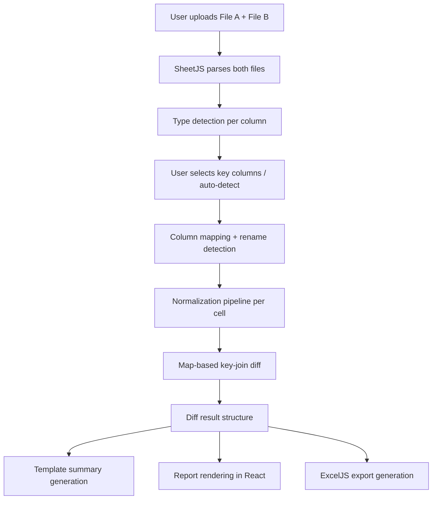

# feat: Build tabular data diff web app

## Summary

A Vite + React 19 + TypeScript SPA with Tailwind v4, using SheetJS for file parsing, ExcelJS for styled Excel output, react-dropzone for upload, and a custom Map-based diff engine with type-aware normalization. Deployed as a static site to Cloudflare Pages.

---

## Problem Frame

People reconciling tabular data have no tool that treats spreadsheets as structured data rather than text. The tool bridges that gap for non-technical users who need a link that works immediately. (See origin: `docs/brainstorms/tabular-diff-tool-requirements.md` for full problem frame.)

---

## Requirements

Carried from origin requirements document:

**File handling:** R1-R4 (CSV/XLSX upload, mixed types, client-side SheetJS parsing, first sheet only)

**Key column selection:** R5-R8 (display headers, interactive select, auto-detect with clear indication, prompt on failure)

**Diff computation:** R9-R13 (row-level add/remove/modify, column-level add/remove/reorder, rename detection, mismatched schema handling)

**Tolerant matching:** R14-R18 (whitespace, numeric equivalence, leading zeros, date normalization, case-insensitive option)

**Report output:** R19-R22 (template summary, structured report, cell-level before/after, in-browser readable)

**Download:** R23-R25 (Excel primary, CSV secondary, standalone-useful context)

**User experience:** R26-R29 (self-explanatory page, desktop-first, drag-drop with feedback, processing indicator)

**Origin acceptance examples:** AE1 (R14/R15 — numeric tolerance), AE2 (R16 — leading zeros in text), AE3 (R17 — date normalization), AE4 (R12 — column rename detection), AE5 (R13 — mismatched columns), AE6 (R7/R8 — auto-detect failure graceful)

---

## Scope Boundaries

- No auth, user accounts, or saved state
- No LLM or AI-generated content
- No CLI interface
- No three-way merge or conflict resolution
- No database-to-database comparison
- No visual side-by-side diff panels
- No diffing inside unstructured fields
- No multi-sheet XLSX comparison
- No server-side processing
- No mobile optimization
- No saved configurations or reusable presets
- No E2E browser testing (unit tests for diff engine only in v1)
- No CI/CD pipeline (manual wrangler deploy for v1)

---

## Context & Research

### External References

- SheetJS parse options: `cellDates: true`, `cellNF: true`, `sheets: 0` for type-aware parsing
- ExcelJS browser build for styled Excel generation (cell fill, font color for changes)
- react-dropzone hook-based API for file upload with MIME type filtering
- dayjs + customParseFormat plugin for date normalization across formats
- Map-based key-join pattern for O(n+m) row matching
- daff library's "action column" pattern (`+`, `-`, `→`) as model for diff result structure
- Tailwind v4: single `@import "tailwindcss"` in CSS, `@tailwindcss/vite` plugin, no config file
- Vite 8 with `react-ts` template (React 19, TypeScript, SWC)
- Cloudflare Pages: `wrangler.jsonc` with `not_found_handling: "single-page-application"`

---

## Key Technical Decisions

- **SheetJS for reading, ExcelJS for writing:** SheetJS has superior format detection and type metadata (`cellNF`, `.t`, `.w` properties). ExcelJS supports cell styling (highlighted changes, colored fonts) which SheetJS free edition strips. Two libraries is the pragmatic split.
- **Custom diff engine over daff library:** Requirements demand specific normalization behaviors (leading-zero-aware, date-format-aware, numeric-epsilon). Custom Map-based join gives full control over the tolerance pipeline while staying simple at this row count.
- **Diff engine decoupled from React:** Pure TypeScript functions in `src/lib/` — testable without DOM, reusable if CLI or Worker added later.
- **Type detection from cell metadata:** SheetJS `.t` property + `.z` format string detects whether a column is numeric, date, or text — drives which normalization function applies per column.
- **dayjs for date parsing:** Lightweight (2KB), supports custom format arrays, strict-mode parsing to avoid false positives on numeric values that look date-like.
- **No state management library:** Linear single-page flow (upload → configure → view) fits React's built-in useState/useReducer. No shared state across routes.
- **Tailwind v4:** Zero-config setup with Vite plugin. Utility-first CSS is fast for building polished UI without design system overhead.

---

## Open Questions

### Resolved During Planning

- **Diff algorithm choice:** Map-based key-join (O(n+m)). Research confirmed this handles tens of thousands of rows instantly in-browser. No need for Web Workers.
- **Excel generation library:** ExcelJS. Only library that supports cell styling in browser builds without the paid SheetJS Pro license.
- **Date library:** dayjs with customParseFormat. Lighter than date-fns for this use case, strict mode prevents false date detection.

### Deferred to Implementation

- **Exact column-rename similarity threshold:** Needs tuning with real data. Start with Levenshtein distance on names + Jaccard similarity on content; adjust threshold during implementation.
- **Summary paragraph templates:** Exact phrasing of the template strings will be refined as the report takes shape.
- **Tolerance toggle UI positioning:** Where exactly the case-sensitivity toggle sits in the layout — decide when building the comparison config step.

---

## Output Structure

```
src/
├── components/
│   ├── App.tsx
│   ├── FileUpload.tsx
│   ├── ColumnPicker.tsx
│   ├── DiffReport.tsx
│   ├── DiffSummary.tsx
│   ├── RowChanges.tsx
│   ├── ColumnChanges.tsx
│   └── DownloadOptions.tsx
├── lib/
│   ├── parser.ts
│   ├── differ.ts
│   ├── normalizer.ts
│   ├── column-detector.ts
│   ├── summary-generator.ts
│   └── export.ts
├── hooks/
│   └── use-diff-workflow.ts
├── types/
│   └── index.ts
├── main.tsx
└── index.css
tests/
├── lib/
│   ├── parser.test.ts
│   ├── differ.test.ts
│   ├── normalizer.test.ts
│   ├── column-detector.test.ts
│   └── summary-generator.test.ts
└── fixtures/
    ├── simple-a.csv
    ├── simple-b.csv
    ├── dates-a.xlsx
    └── dates-b.xlsx
```

---

## High-Level Technical Design

> *This illustrates the intended approach and is directional guidance for review, not implementation specification. The implementing agent should treat it as context, not code to reproduce.*



**Normalization pipeline (per cell):**
- Detect column type from SheetJS metadata (`.t` property, `.z` format string)
- Numeric columns → `Number()` + epsilon comparison
- Date columns → dayjs parse with format array → ISO string
- Text columns with `@` format → preserve `.w` value (leading zeros)
- All columns → trim + collapse whitespace
- Case-insensitive mode → `.toLowerCase()` after other normalization

**Key-join diff (core algorithm):**
- Build `Map<compositeKey, rowIndex>` for both files
- Keys in B not in A → added rows
- Keys in A not in B → removed rows
- Keys in both → compare normalized cell values column by column → modified rows with change list

---

## Implementation Units

### U1. Project scaffold and deployment pipeline

**Goal:** Working React + TypeScript + Tailwind v4 app deployed to Cloudflare Pages with a placeholder landing page.

**Requirements:** Foundation for all subsequent work.

**Dependencies:** None

**Files:**
- Create: `package.json`, `vite.config.ts`, `tsconfig.json`, `tsconfig.app.json`, `wrangler.jsonc`, `src/main.tsx`, `src/App.tsx`, `src/index.css`, `index.html`
- Modify: `.gitignore` (add node_modules, dist)

**Approach:**
- Scaffold with `npm create vite@latest` using `react-ts` template
- Add Tailwind v4 via `@tailwindcss/vite` plugin
- Add `wrangler.jsonc` with `not_found_handling: "single-page-application"`
- Placeholder page with project name and "Coming soon" — confirms deployment works
- Add path alias `@/` → `src/` in Vite and tsconfig

**Patterns to follow:**
- Vite 8 standard `react-ts` template structure
- Tailwind v4 single `@import "tailwindcss"` pattern

**Test expectation:** none — scaffold only, verified by successful build and deploy

**Verification:**
- `npm run build` succeeds
- `npx wrangler pages deploy dist` deploys successfully
- Placeholder page renders at the Cloudflare Pages URL

---

### U2. Type system and core data structures

**Goal:** Define TypeScript types for the entire data flow — parsed files, diff configuration, diff results, and export data.

**Requirements:** R9, R10, R11, R12, R13, R14-R18

**Dependencies:** U1

**Files:**
- Create: `src/types/index.ts`
- Test: `tests/lib/differ.test.ts` (type usage validated implicitly by compiler)

**Approach:**
- Define `ParsedFile` (rows as record arrays, column metadata with detected types)
- Define `DiffConfig` (key columns, tolerance settings, case-insensitive flag)
- Define `DiffResult` (added/removed/modified/unchanged counts, column changes, row changes)
- Define `ColumnChange` (added/removed/renamed/reordered)
- Define `RowChange` with per-cell `CellDiff` (column, oldValue, newValue, normalized flag)
- Define `ColumnMetadata` (name, detectedType: 'number' | 'date' | 'text' | 'unknown', formatString)

**Patterns to follow:**
- Discriminated unions for change types (column added vs removed vs renamed)
- Immutable data flow — types should encourage treating diff results as read-only

**Test expectation:** none — pure type definitions, validated by TypeScript compiler

**Verification:**
- TypeScript compiles with strict mode
- Types are imported and used without `any` casts in subsequent units

---

### U3. File parser module

**Goal:** Parse CSV and XLSX files into a normalized `ParsedFile` structure with column type detection.

**Requirements:** R1, R2, R3, R4

**Dependencies:** U1, U2

**Files:**
- Create: `src/lib/parser.ts`
- Test: `tests/lib/parser.test.ts`
- Create: `tests/fixtures/simple-a.csv`, `tests/fixtures/simple-b.csv`, `tests/fixtures/dates-a.xlsx`

**Approach:**
- Use SheetJS with `{ type: 'array', cellDates: true, cellNF: true, sheets: 0 }`
- Extract first row as column headers via `sheet_to_json` with `{ header: 1 }`
- Detect column types by scanning cell `.t` properties across first 100 rows (majority vote)
- Detect text-formatted columns via `.z === '@'` (leading zero preservation)
- Return `ParsedFile` with rows, column names, and column metadata
- Handle both CSV (auto-detected by SheetJS) and XLSX identically after parse

**Test scenarios:**
- Happy path: parse a simple 3-column CSV with headers → correct ParsedFile structure
- Happy path: parse an XLSX file → same ParsedFile structure as equivalent CSV
- Edge case: file with mixed types in a column (numbers and strings) → detects as text
- Edge case: file with date serial numbers → correctly identifies as date column
- Edge case: file with `@` format (text) columns → marks as text type, preserves `.w` values
- Edge case: empty file (headers only, no data rows) → returns ParsedFile with zero rows and correct column names
- Error path: invalid/corrupt file → throws descriptive error

**Verification:**
- CSV and XLSX of the same data produce identical ParsedFile output
- Column type detection matches expected types for test fixtures

---

### U4. Normalization pipeline

**Goal:** Normalize cell values for comparison based on detected column type, with configurable tolerances.

**Requirements:** R14, R15, R16, R17, R18

**Dependencies:** U2, U3

**Files:**
- Create: `src/lib/normalizer.ts`
- Test: `tests/lib/normalizer.test.ts`

**Approach:**
- Main function: `normalizeValue(value, columnMeta, config)` → normalized string for comparison
- Numeric normalization: `Number()` conversion, epsilon comparison (1e-9), strip currency symbols
- Date normalization: dayjs with format array `['YYYY-MM-DD', 'MM/DD/YYYY', 'DD/MM/YYYY', 'M/D/YYYY', 'MMM D, YYYY']` → ISO output
- Text normalization: trim + collapse whitespace
- Leading zero handling: if column type is text (`.z === '@'`), preserve original; if numeric, normalize
- Case-insensitive mode: `.toLowerCase()` after other normalization
- Excel date serial detection: if numeric value between 1 and 2958465 in a date column, convert
- Comparison function: `valuesAreEqual(a, b, columnMeta, config)` → boolean

**Test scenarios:**
- Covers AE1. Happy path: "  $12.00 " vs "$12" in numeric column → equal
- Covers AE2. Happy path: "007891" vs "7891" in text column (format "@") → NOT equal
- Happy path: "007891" vs "7891" in numeric column → equal (both are 7891)
- Covers AE3. Happy path: "2024-01-15" vs "01/15/2024" in date column → equal
- Happy path: "Jan 15, 2024" vs "2024-01-15" → equal
- Happy path: "  hello   world  " vs "hello world" → equal (whitespace normalization)
- Happy path: "Active" vs "active" with case-insensitive ON → equal
- Happy path: "Active" vs "active" with case-insensitive OFF → NOT equal
- Edge case: null/undefined/empty string comparisons → all normalize to empty, compare equal
- Edge case: Excel date serial 45307 in date column → normalizes to "2024-01-15"
- Edge case: value that looks like a date but in a text column → no date parsing, compare as text
- Error path: dayjs fails to parse date string → falls back to string comparison

**Verification:**
- Each acceptance example from the origin doc passes as a test case
- Normalization is pure (same input always produces same output)

---

### U5. Column analysis and rename detection

**Goal:** Map columns between two files — identify matches, additions, removals, renames, and reordering.

**Requirements:** R11, R12, R13

**Dependencies:** U2, U3

**Files:**
- Create: `src/lib/column-detector.ts`
- Test: `tests/lib/column-detector.test.ts`

**Approach:**
- Exact match first: same column name in both files → matched
- Remaining unmatched: compute similarity score (name Levenshtein distance + content Jaccard similarity)
- Threshold for rename detection: combined score above configurable threshold (start at 0.7)
- Content sampling: compare unique values in first 100 rows of each unmatched column pair
- Output: `ColumnMapping` listing matched, added, removed, renamed (with confidence), reordered
- Reorder detection: compare position indices of matched columns

**Test scenarios:**
- Happy path: identical column sets → all matched, no changes
- Covers AE5. Happy path: File A has 12 columns, File B has 15 (10 in common) → 2 removed, 5 added, 10 matched
- Covers AE4. Happy path: "customer_name" → "client_name" with 90% content overlap → flagged as probable rename
- Edge case: two columns could be renames of the same source → pick highest confidence match
- Edge case: column with same name but completely different content → still matched by name (name takes priority)
- Edge case: columns reordered but all names match → reports reordering, no adds/removes

**Verification:**
- Rename detection fires on semantically similar columns with overlapping content
- Does not false-positive on unrelated columns that happen to have short similar names

---

### U6. Core diff engine

**Goal:** Compute row-level differences between two parsed files using key-column matching and the normalization pipeline.

**Requirements:** R9, R10, R13

**Dependencies:** U2, U3, U4, U5

**Files:**
- Create: `src/lib/differ.ts`
- Test: `tests/lib/differ.test.ts`
- Create: `tests/fixtures/modified-a.csv`, `tests/fixtures/modified-b.csv`

**Approach:**
- Build `Map<compositeKey, rowIndex>` for both files using selected key columns
- Composite key: normalized values of key columns joined with null separator (`\x00`)
- Three-pass comparison: added (in B not A), removed (in A not B), modified (in both, values differ)
- Modified row detection: iterate overlapping columns, compare normalized values, collect `CellDiff` list
- Handle mismatched columns: only compare columns present in both files (per column mapping from U5)
- Return complete `DiffResult` structure

**Test scenarios:**
- Happy path: identical files → zero added/removed/modified, all unchanged
- Happy path: 3 rows added in B → 3 in added, rest unchanged
- Happy path: 2 rows removed from A → 2 in removed, rest unchanged
- Happy path: 5 rows modified (single column change each) → 5 in modified with correct before/after
- Happy path: multi-column key (composite) → correct matching
- Edge case: duplicate key values in one file → last occurrence wins (or flag as warning)
- Edge case: key column has null/empty values → treat as string "null" key
- Edge case: mismatched column sets → diffs only overlapping columns
- Integration: tolerant matching applied (12.00 vs 12 not flagged as change in numeric column)
- Integration: date normalization applied (different format same date not flagged)

**Verification:**
- Diff is symmetric in the expected way: swapping A and B turns "added" into "removed" and vice versa
- Performance: 5000 rows × 20 columns completes in under 1 second

---

### U7. Key column auto-detection

**Goal:** Automatically identify likely key columns when user clicks auto-detect.

**Requirements:** R7, R8

**Dependencies:** U2, U3

**Files:**
- Modify: `src/lib/column-detector.ts` (add key detection function)
- Test: `tests/lib/column-detector.test.ts` (add key detection scenarios)

**Approach:**
- Heuristic priority: (1) column named exactly `id`, (2) column matching `*_id` pattern, (3) column named `key`, (4) first column with all unique values
- Validate candidate across both files: key must exist in both and have unique values in both
- If no candidate found, return null (triggers prompt to user per R8)
- Return detected key column(s) with explanation string ("Detected 'employee_id' as key — all values unique in both files")

**Test scenarios:**
- Happy path: column named "id" with unique values → detected as key
- Happy path: column named "order_id" → detected (matches *_id pattern)
- Happy path: no named match but first column has all-unique values → detected with explanation
- Covers AE6. Edge case: no column has unique values → returns null, triggers manual prompt
- Edge case: "id" column exists but has duplicates → skips it, tries next heuristic
- Edge case: multiple *_id columns → picks first one that has unique values in both files

**Verification:**
- Auto-detect returns a clear explanation string alongside the selected key
- Returns null (not a guess) when no confident candidate exists

---

### U8. Summary generator

**Goal:** Generate a template-based human-readable summary paragraph from diff results.

**Requirements:** R19

**Dependencies:** U2, U6

**Files:**
- Create: `src/lib/summary-generator.ts`
- Test: `tests/lib/summary-generator.test.ts`

**Approach:**
- Template-based string construction from DiffResult counts
- Pattern detection: identify most common change (which column changed most, what the typical value transition was)
- Output format: "X rows added, Y removed, Z modified across N columns. Most common change: [column] field [pattern description]."
- Handle edge cases: no changes ("Files are identical"), only additions, only removals

**Test scenarios:**
- Happy path: mixed changes → "142 rows added, 7 removed, 23 modified across 4 columns. Most common change: status field changed from 'pending' to 'approved' in 18 rows."
- Happy path: no changes → "Files are identical. No differences found."
- Happy path: only additions → "58 new rows added. No existing rows were modified or removed."
- Edge case: modified rows span many columns → reports top 2-3 most-changed columns
- Edge case: most common change has no clear pattern → omits pattern clause, just reports counts

**Verification:**
- Summary is always one paragraph, readable by non-technical user
- Counts in summary match actual DiffResult counts

---

### U9. File upload UI with drag-and-drop

**Goal:** Build the file upload interface with drag-drop zones for File A and File B.

**Requirements:** R1, R26, R27, R28, R29

**Dependencies:** U1, U3

**Files:**
- Create: `src/components/FileUpload.tsx`
- Modify: `src/App.tsx`

**Approach:**
- Two side-by-side react-dropzone zones ("File A (Before)" and "File B (After)")
- Accept `.csv` and `.xlsx` MIME types
- Visual feedback: border color change on drag-over, file name display after upload
- Parse immediately on drop (call parser from U3)
- Show loading state during parse, error state on failure
- Brief instructions above the upload zones explaining what the tool does

**Patterns to follow:**
- react-dropzone `useDropzone` hook pattern with `getRootProps`/`getInputProps`
- Tailwind utility classes for responsive layout and states

**Test expectation:** none — UI component, verified visually

**Verification:**
- Drag-drop works for both zones independently
- File name and row/column count shown after successful parse
- Error displayed for invalid files
- Clear visual distinction between "before" and "after" file slots

---

### U10. Column picker UI

**Goal:** Interactive column selection interface after both files are uploaded.

**Requirements:** R5, R6, R7, R8

**Dependencies:** U1, U7, U9

**Files:**
- Create: `src/components/ColumnPicker.tsx`

**Approach:**
- Display column headers from both files
- Checkboxes or click-to-select for key column choice
- "Auto-detect" button that runs heuristic and shows what it picked with explanation
- If auto-detect returns null, show message prompting manual selection
- Case-insensitive toggle (R18) shown here as a comparison option
- "Compare" button enabled only when at least one key column is selected

**Patterns to follow:**
- Tailwind form styling utilities
- React controlled components for selection state

**Test expectation:** none — UI component, verified visually

**Verification:**
- All columns from both files visible
- Auto-detect button works and shows explanation
- Compare button disabled until valid key selection
- Case-insensitive toggle clearly labeled with default OFF

---

### U11. Diff report display

**Goal:** Render the diff results as a readable in-browser report.

**Requirements:** R19, R20, R21, R22, R27

**Dependencies:** U1, U6, U8

**Files:**
- Create: `src/components/DiffReport.tsx`, `src/components/DiffSummary.tsx`, `src/components/RowChanges.tsx`, `src/components/ColumnChanges.tsx`

**Approach:**
- Summary paragraph at top (from U8)
- Column changes section: list of added/removed/renamed columns with clear labels
- Row changes grouped by type: Added (green), Removed (red), Modified (yellow/amber)
- Modified rows: expandable to show per-cell before/after values
- Table format for row display with key column values as identifiers
- Pagination or virtual scrolling if modified rows exceed ~50

**Patterns to follow:**
- Tailwind color utilities for change-type indication
- Semantic HTML tables for data display
- Details/summary or click-to-expand for modified row details

**Test expectation:** none — UI component, verified visually

**Verification:**
- Summary paragraph renders at top
- Column changes clearly labeled
- Row changes grouped and color-coded
- Modified rows show before/after values per cell
- Report is scannable and readable by non-technical user

---

### U12. Excel and CSV export

**Goal:** Generate downloadable Excel and CSV files from diff results.

**Requirements:** R23, R24, R25

**Dependencies:** U2, U6

**Files:**
- Create: `src/lib/export.ts`
- Create: `src/components/DownloadOptions.tsx`

**Approach:**
- Excel export via ExcelJS browser build:
  - Sheet 1 "Summary": summary text + counts
  - Sheet 2 "Changes": all changed rows with columns: Key, Column, Old Value, New Value, Change Type
  - Cell styling: green fill for added, red for removed, yellow for modified
  - Column auto-width for readability
- CSV export: flat table of all changes (same structure as Sheet 2 but without styling)
- Download triggered via `Blob` + URL.createObjectURL + click
- Both buttons visible in the report view

**Test scenarios:**
- Happy path: generate Excel from diff with 10 modified rows → valid .xlsx file with correct data
- Happy path: generate CSV from same diff → correct CSV with headers and change data
- Edge case: diff with zero changes → Excel shows "No differences found" in summary sheet
- Edge case: cell values containing commas and quotes → CSV properly escaped

**Verification:**
- Downloaded Excel opens in Excel/Google Sheets without corruption
- Changed cells are highlighted with appropriate colors
- CSV is valid and importable
- Both downloads include key column values so rows are identifiable standalone

---

### U13. Workflow orchestration and state management

**Goal:** Wire all components into a cohesive single-page flow with appropriate state transitions.

**Requirements:** R26, R29

**Dependencies:** U9, U10, U11, U12

**Files:**
- Create: `src/hooks/use-diff-workflow.ts`
- Modify: `src/App.tsx`

**Approach:**
- Workflow state machine: `idle` → `files-uploaded` → `configured` → `computing` → `results`
- Custom hook `useDiffWorkflow` manages state transitions and holds parsed files + diff results
- Processing state shows spinner/progress indicator during diff computation
- Error boundary catches and displays parse or diff errors gracefully
- "Start over" button resets to idle state

**Patterns to follow:**
- React `useReducer` for state machine pattern
- Conditional rendering based on workflow step

**Test expectation:** none — orchestration component, verified by end-to-end manual testing

**Verification:**
- Complete flow works: upload → pick columns → view report → download
- Processing indicator visible during diff computation
- Errors displayed clearly without crashing
- "Start over" resets cleanly

---

## System-Wide Impact

- **Interaction graph:** Linear flow, no callbacks or middleware. Components communicate via props and the workflow hook.
- **Error propagation:** Parse errors surface at file upload step. Diff errors surface at computation step. Export errors surface at download step. All show user-friendly messages.
- **State lifecycle risks:** No persistence, no partial writes. If the tab closes, state is lost (acceptable — no saved state by design).
- **API surface parity:** No API — single-page app with no external calls.
- **Integration coverage:** The critical integration is parser → normalizer → differ → export. Unit tests at each boundary; manual testing for the full flow.

---

## Risks & Dependencies

| Risk | Mitigation |
|------|------------|
| SheetJS XLSX parsing edge cases (merged cells, multi-line headers) | Document as limitation; test with real user files early |
| Column rename false positives | Conservative threshold (0.7); label as "probable" not "definite" |
| ExcelJS browser bundle size | Lazy-load at download time, not on page load |
| Large file performance (approaching 10K+ rows) | Profile early; add Web Worker if needed (stretch, not v1 requirement) |
| Date format ambiguity (01/02/2024 — Jan 2 or Feb 1?) | Default to MM/DD/YYYY (US locale); note in UI that ambiguous dates use this assumption |

---

## Sources & References

- **Origin document:** `docs/brainstorms/tabular-diff-tool-requirements.md`
- External: [SheetJS docs](https://docs.sheetjs.com/), [ExcelJS npm](https://www.npmjs.com/package/exceljs), [react-dropzone](https://react-dropzone.js.org/), [dayjs](https://day.js.org/), [Tailwind v4](https://tailwindcss.com/blog/tailwindcss-v4), [Cloudflare Pages](https://developers.cloudflare.com/pages/)
